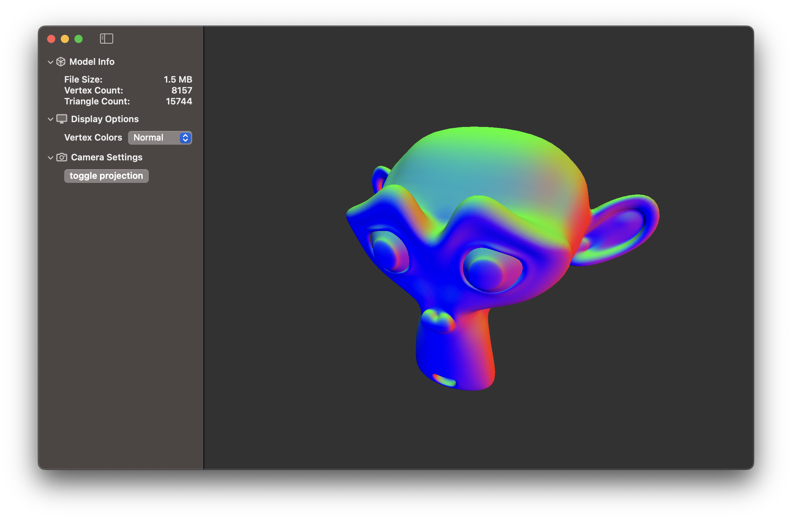
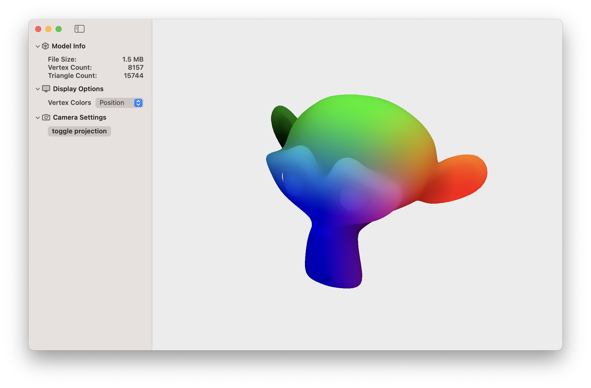

# Mesh Preview
A simple macOS app for previewing 3D Assets. This project is still very much a work in progress and lacks a lot of features and functionality. Currently, the app can load models from files supported by the ModelIO framework and color the model based on vertex data. The projection used by the camera can also be toggled between perspective and orthographic. In the future I would like to add support for textures and basic lighting.

# Images

